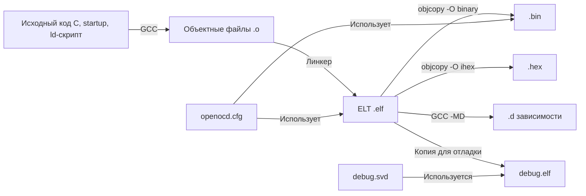

# Справочник по форматам файлов прошивки AM32

При сборке прошивки для регуляторов на базе STM32F421 (проект AM32 NEUTRON 2.6S AIO) генерируется целый комплект файлов.  
Каждый из них решает свою задачу: от распространения готовой прошивки до отладки и программирования.  
Ниже – подробный разбор всех форматов, попавших в директорию сборки.

---

## 1. `.bin` – Чистый бинарный образ прошивки

**Файл:** `AM32_NEUTRON_2_6S_AIO_F421_2.20.bin` (27 КБ)  

### Что внутри
Сырой, непрерывный массив байтов – точное содержимое Flash-памяти микроконтроллера.  
Никаких метаданных, адресов или служебной информации – только код и константные данные.

### Как посмотреть
```bash
# Показать первые 256 байт в hex
xxd AM32_NEUTRON_2_6S_AIO_F421_2.20.bin | head -20
# Или шестнадцатеричный дамп с адресами (начиная с 0)
hexdump -C AM32_NEUTRON_2_6S_AIO_F421_2.20.bin | head -30
```
В Windows можно открыть в любом HEX-редакторе (HxD, WinHex).

### Особенности
- Не содержит адресов – прошивается **строго по фиксированному базовому адресу** (обычно `0x08000000` для STM32).
- Минимальный размер – равно размеру занятой Flash-памяти без дыр.
- Используется для быстрой прошивки через UART/DFU/Bootloader.
- **Нельзя** определить, откуда начинать шить, если нет дополнительной информации (технически – всегда с начала).

### Полезные сведения
- Для создания из ELF:
  ```bash
  arm-none-eabi-objcopy -O binary firmware.elf firmware.bin
  ```
- Если требуется объединить с загрузчиком, `.bin`-файлы просто склеиваются с учётом смещений.

---

## 2. `.d` – Файл зависимостей

**Файл:** `AM32_NEUTRON_2_6S_AIO_F421_2.20.d` (3 КБ)

### Что внутри
Текстовый файл, генерируемый компилятором GCC при флаге `-MD`.  
Содержит правила make-подобного формата для отслеживания заголовочных файлов (`.h`), от которых зависит объектный файл.

Примерное содержимое:
```
build/main.o: main.c config.h hal/gpio.h drivers/timer.h ...
```

### Как посмотреть
Обычный текстовый редакторили `cat AM32_NEUTRON_2_6S_AIO_F421_2.20.d` в терминале.

### Особенности
- Используется утилитой `make` для автоматического перекомпилирования файлов при изменении любого из включённых заголовков.
- Можно не удалять – они участвуют в инкрементальной сборке.
- Если файлов `.d` несколько (по одному на каждый `.c`), они хранятся в папке сборки, а один сводный `.d` может описывать весь проект.

### Полезные сведения
- По такому файлу можно быстро восстановить полное дерево `#include` конкретного модуля.
- Если сборка «не замечает» изменений в `.h`, стоит проверить актуальность `.d`-файлов.

---

## 3. `.elf` – Исполняемый файл с отладочной информацией

**Файлы:**  
- `AM32_NEUTRON_2_6S_AIO_F421_2.20.elf` (453 КБ)  
- `debug.elf` (453 КБ) – вероятно, его же копия для удобства запуска отладчика.

### Что внутри
Формат ELF (Executable and Linkable Format), полный образ программы, содержащий:
- секции кода (`.text`), данных (`.data`, `.rodata`), неинициализированных переменных (`.bss`);
- таблицу символов (функции, глобальные переменные);
- отладочную информацию DWARF (строки исходников, типы, номера строк);
- таблицу сегментов/секций для загрузчика.

### Как посмотреть
Используйте тулчейн `arm-none-eabi-*` (или любой ELF-ридер):
```bash
# Заголовок ELF-файла
arm-none-eabi-readelf -h AM32_NEUTRON_2_6S_AIO_F421_2.20.elf

# Список секций
arm-none-eabi-objdump -h AM32_NEUTRON_2_6S_AIO_F421_2.20.elf

# Просмотр всех публичных символов с размерами
arm-none-eabi-nm --size-sort -S AM32_NEUTRON_2_6S_AIO_F421_2.20.elf

# Дизассемблирование (код + секции данных)
arm-none-eabi-objdump -d -S AM32_NEUTRON_2_6S_AIO_F421_2.20.elf | less

# Общая статистика памяти
arm-none-eabi-size AM32_NEUTRON_2_6S_AIO_F421_2.20.elf
```

### Особенности
- Самый большой файл (453 КБ против 27 КБ `.bin`) за счёт отладочных символов.
- Именно ELF подаётся на вход отладчику (GDB) вместе с ELF-файлом.
- Позволяет прошивать через программаторы, понимающие ELF (OpenOCD, ST-Link Utility).
- Содержит всю карту памяти: адреса загрузки секций, точку входа.

### Полезные сведения
- Можно **удалить отладочную информацию**, оставив только код, командой `strip`.
- Если `debug.elf` – отдельная копия, она сделана для того, чтобы не портить основной файл, когда среда разработки модицифирует символы.

---

## 4. `.hex` – Intel HEX

**Файл:** `AM32_NEUTRON_2_6S_AIO_F421_2.20.hex` (62 КБ)

### Что внутри
Текстовый формат представления образа. Каждая строка имеет вид:
```
: BB AAA TT [DD...] CC
```
- `:` – начало записи
- `BB` – количество байт данных в строке
- `AAA` – адрес (16 бит, часть полного адреса)
- `TT` – тип записи (00 – данные, 01 – конец файла, 04 – расширенный линейный адрес и др.)
- `DD` – данные
- `CC` – контрольная сумма

### Как посмотреть
Обычным текстовым редактором или `head`:
```bash
head -20 AM32_NEUTRON_2_6S_AIO_F421_2.20.hex
```
Пример строки:
```
:020000040800F2
:1000000000000220B90F0008550C0008550C0008D9
:00000001FF
```

### Особенности
- Хранит **адреса** прошивки внутри записей, поэтому универсален – программатор сам знает, куда писать.
- Контрольная сумма в каждой строке повышает надёжность передачи.
- Часто используется с STM32CubeProgrammer, OpenOCD (через `program file.hex`).
- Размер больше BIN (62 КБ против 27 КБ), потому что текстовое представление избыточно.

### Полезные сведения
- Легко объединяется с отдельным hex‑файлом загрузчика (при правильном распределении адресов).
- При конвертации из ELF поддерживает пропуск пустых областей.

---

## 5. `.svd` – Описание периферии для отладки

**Файл:** `debug.svd` (441 КБ)

### Что внутри
System View Description – XML-файл по стандарту CMSIS. Описывает все регистры периферийных блоков микроконтроллера (GPIO, TIM, ADC, DMA и т.д.), их адреса, битовые поля, допустимые значения.

### Как посмотреть
Любой текстовый редактор (огромный XML) или специализированный SVD viewer.
```bash
head -100 debug.svd
```
Обычно включает структуры типа:
```xml
<peripheral>
  <name>TIM2</name>
  <baseAddress>0x40000000</baseAddress>
  <registers> ... </registers>
</peripheral>
```

### Особенности
- Не участвует в прошивке, используется **только во время отладки**.
- Подключается к GDB/Visual Studio Code (через расширение Cortex-Debug, SVD Viewer), чтобы при просмотре регистров показывать их осмысленные имена, битовые поля и пояснения.
- Файл можно взять из официального пакета CMSIS или сгенерировать самостоятельно.

### Полезные сведения
- С файлом `.svd` вы видите не просто `0x40020014`, а `GPIOA->ODR` с раскладкой по битам.
- Если отладчик не показывает регистры периферии, проверьте, подгружен ли правильный `.svd`.

---

## 6. `openocd.cfg` – Конфигурация программатора OpenOCD

**Файл:** `openocd.cfg` (1 КБ)

### Что внутри
Скрипт на языке Tcl для OpenOCD (Open On-Chip Debugger). Содержит описание:
- интерфейса программатора (stlink-v2, cmsis-dap, jlink...);
- способа транспорта (hla_serial, swd);
- целевого чипа (`stm32f4x` или конкретно `stm32f421`);
- скриптов инициализации, сброса, команд программирования.

Пример содержимого:
```tcl
source [find interface/stlink-v2.cfg]
source [find target/stm32f4x.cfg]
reset_config srst_only

program firmware.elf verify reset exit
```

### Как посмотреть
Любой текстовый редактор, `cat`.

### Особенности
- Используется для запуска OpenOCD командой `openocd -f openocd.cfg`.
- Может содержать инструкции автоматической прошивки при старте (директива `program`).
- Позволяет кастомизировать процедуры прошивки/верификации.

### Полезные сведения
- Обратите внимание на строчку `program` – она определяет, какой файл будет автоматически загружен.
- Можно настроить разные конфигурации для прошивки через отладчик и для внешнего программатора.

---

## Сравнительная таблица

| Формат | Размер | Содержимое | Назначение | Как прочитать |
|--------|--------|------------|------------|---------------|
| `.bin` | 27 КБ | Бинарный код | Быстрая прошивка через загрузчик, UART | HEX-редактор, `xxd` |
| `.d`   | 3 КБ  | Правила зависимостей Make | Инкрементальная сборка, отслеживание `#include` | Текстовый редактор |
| `.elf` | 453 КБ | Полный образ + отладочная информация | Отладка, дизассемблирование, «мастер-файл» | `arm-none-eabi-readelf`, `objdump`, `nm` |
| `.hex` | 62 КБ | Текстовый образ с адресами | Универсальное программирование большинством утилит | Текстовый редактор |
| `.svd` | 441 КБ | XML-описание периферии | Отображение регистров в отладчике | Текстовый редактор, SVD viewer |
| `.cfg` | 1 КБ  | Tcl-скрипт для OpenOCD | Запуск и настройка программатора/отладчика | Текстовый редактор |

---

## Как эти форматы связаны в процессе сборки



1. Компилятор создаёт объектные файлы и `.d`‑файлы зависимостей.
2. Линкер собирает всё в один `.elf` – **центральный артефакт**.
3. Из `.elf` штампуются `.bin` (чистый код) и `.hex` (код с адресами для программаторов).
4. Для удобства отладки делается копия `debug.elf`, её можно смело править или переименовывать.
5. `debug.svd` при отладке подгружается к ELF, чтобы расшифровать регистры.
6. `openocd.cfg` скриптует взаимодействие со всеми этими файлами.

---

## Зачем сохранять всё это

- **Хранение артефактов**: `ELF` хранит символы, по которым всегда можно восстановить версию.
- **Повторная отладка**: Имея `debug.elf` и `debug.svd`, можно подключиться отладчиком и читать регистры даже без скачивания исходников.
- **Автоматизация**: `.d` и `openocd.cfg` ускоряют повторную сборку и программирование.
- **Распространение прошивки**: Конечному пользователю обычно отдают `.hex` (удобнее программатору) или `.bin` (для загрузчика).

---

## Полезные команды тулчейна (шпаргалка)

```bash
# Информация о секциях (размеры и адреса)
arm-none-eabi-size firmware.elf

# Память, занимаемая функциями/переменными (топ-20)
arm-none-eabi-nm --size-sort -S firmware.elf | tail -20

# Список используемых заголовков из .d файла
grep -oE '[^ ]+\.h' firmware.d | sort -u

# Преобразование ELF -> BIN / HEX
arm-none-eabi-objcopy -O binary firmware.elf firmware.bin
arm-none-eabi-objcopy -O ihex firmware.elf firmware.hex

# Отладка с OpenOCD и GDB
openocd -f openocd.cfg
```

---

*Руководство подготовлено на основе артефактов сборки AM32 NEUTRON 2.6S AIO для STM32F421.*  
*Последнее обновление: апрель 2026.*
